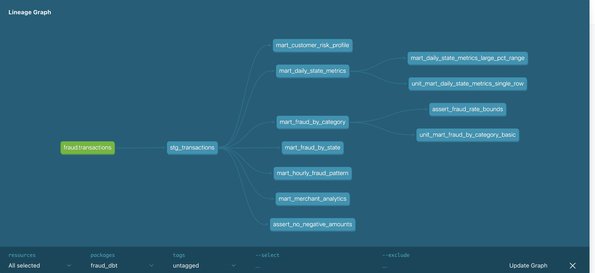
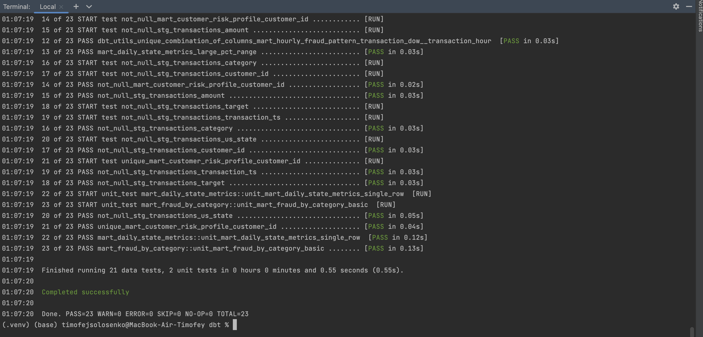

# Fraud dbt

## Requirements

### Versions
- **dbt-core:** 1.11.2  
- **dbt-clickhouse:** 1.9.7
---

### Source
- `fraud.transactions`  
  Сырые транзакции в ClickHouse.

### Staging model
- **`stg_transactions`**
  Слой нормализации/очистки. Формирует:
  - временные поля: `transaction_ts`, `transaction_date`, `transaction_hour`, `transaction_dow`
  - категориальные поля: `merch`, `category`, `gender`, `us_state`
  - числовые поля: `amount`, `target`
  - производные поля: `amount_bucket`, `is_large_amount`
  - ключ: `customer_id`
---

## Витрины

### 1. `mart_daily_state_metrics` — Дневные метрики по штатам
- Агрегация транзакций по дате и штату
- Метрики: количество транзакций, сумма, средний чек, P95, доля крупных транзакций

### 2. `mart_fraud_by_category` — Анализ фрода по категориям
- Выявление категорий с наибольшим уровнем мошенничества
- Метрики: общее число транзакций, число фродов, fraud_rate (%), суммы

### 3. `mart_fraud_by_state` — Географический анализ фрода
- Распределение фрода по штатам США
- Метрики: fraud_rate, уникальные клиенты/мерчанты, суммы

### 4. `mart_customer_risk_profile` — Профиль риска клиентов
- Сегментация клиентов по уровню риска (HIGH/MEDIUM/LOW)
- История транзакций, fraud_rate на клиента, средний чек

### 5. `mart_hourly_fraud_pattern` — Временные паттерны фрода
- Анализ по дням недели и часам
- Выявление временных окон с повышенным риском

### 6. `mart_merchant_analytics` — Аналитика по мерчантам
- Метрики по каждому мерчанту: оборот, fraud_rate, флаг подозрительности
---

## Tests

### Staging tests
- `not_null`:
  - `transaction_ts`, `us_state`, `category`, `amount`, `customer_id`
- `accepted_values`:
  - `target` in `[0, 1]`
- dbt-expectations:
  - `amount` >= 0
  - `gender` in `{"M","F"}`

### Mart-level tests

- **`mart_daily_state_metrics`**
  - `dbt_utils.unique_combination_of_columns(["transaction_date","us_state"])`

- **`mart_hourly_fraud_pattern`**
  - `dbt_utils.unique_combination_of_columns(["transaction_dow","transaction_hour"])`

- **`mart_customer_risk_profile`**
  - `unique_combination_of_columns(["customer_id"])` (or `unique` on `customer_id`)
  - `risk_level` accepted values: `HIGH`, `MEDIUM`, `LOW`

- **Fraud rate bounds**
  - `fraud_rate` within `[0, 100]`

### Singular tests
- `tests/assert_fraud_rate_bounds.sql`
- `assert_no_negative_amounts.sql`
- `mart_daily_state_metrics_large_pct_range.sql`
  - Проверяет, что доля крупных транзакций в витрине `mart_daily_state_metrics` находится в корректном диапазоне. 

### Unit tests
- `unit_mart_daily_state_metrics_single_row`
- `unit_mart_fraud_by_category_basic`
---

## Скриншоты

### DAG

### Логи
